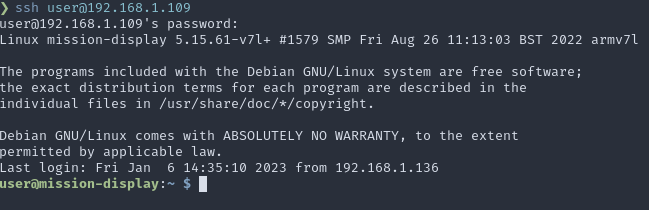

# Table of Contents

1.  [Installation](#org76c12dd)
    1.  [Make a bootable sd card for the Raspberry Pi](#orga429ba1)
    2.  [Login to raspberry pi](#org44163d7)
        1.  [Get IP address of Raspberry Pi](#org72879e4)
        2.  [Login to the Rasberry Pi](#org59ceb0b)
        3.  [Install and Set up display](#orga6c9b66)
    3.  [Uploading Missions Letters to the display](#org989b47e)
2.  [Operation](#org4898ce8)

# Installation

## Make a bootable sd card for the Raspberry Pi

1.  Download the [RPI-Imager](https://www.raspberrypi.com/software/)
2.  Put Micro SD Card into computer
3.  Click &ldquo;Choose OS&rdquo; in RPI-Imager
4.  Select &ldquo;Raspberry Pi OS (other)&rdquo;
5.  Select &ldquo;Raspberry Pi OS (64-bit)&rdquo;
6.  Click &ldquo;Choose Storage&rdquo; and select the Micro SD Card
    -   It may be useful to note the storage capacity of the card before you put it in.
7.  Click the gear button in the bottom right-hand corner
8.  Select the following checkboxes:
    -   Set hostname: mission-display
    -   Enable SSH
    -   Set username and password
        User: user
        Password: nhbcmissions
    -   Configure wireless LAN
        Wireless LAN Country: US
    -   Set locale settings
        Time zone: America/Chicago
        Keyboard layout: us
    -   Click save at the bottom
9.  Click &ldquo;Write&rdquo; and wait for it to finish
10. Put it in the slot on the Raspberry pi and plug it in.

## Login to raspberry pi

### Get IP address of Raspberry Pi

1.  Go here: [DHCP Client Table](http://192.168.1.1/DHCPTable.asp)
2.  Look for &rsquo;mission-display&rsquo; in the **Client Name** Column
3.  Find the corresponding IP Address which looks like 192.168.1.xxx
    -   It might be 192.168.1.109 which is reserved in the router for this device.

### Login to the Rasberry Pi

On Apple products open the *terminal* application
On Windows install [PuTTY](https://www.chiark.greenend.org.uk/~sgtatham/putty/latest.html)

1.  Open the terminal and enter the following: (Replace the ip-address with the ip address you just found)
    
        ssh user@ip-address
2.  Enter the password. You will not see any changes on the screen as you enter the password.
3.  You should get something that looks like this.
    

### Install and Set up display

1.  Copy and paste the following
    
        wget https://raw.githubusercontent.com/RaubJo/missions-display/master/scripts/install.sh
        chmod +x install.sh
        sudo ./install.sh --full-install
2.  You can now upload files via the web file browser (link)
3.  The display will automatically restart every night at midnight.
4.  When it restarts it will put all the uploaded letters into rotation

## Uploading Missions Letters to the display

1.  Go to the web file browser [here](http://192.168.1.109:8080).
2.  Login with these credentials. Username: NHBCwylie, password: nhbcmissions
3.  Enter the folder called &ldquo;letters&rdquo;
4.  Upload letters into this folder by clicking the Up arrow in the top right corner.
5.  The letters will be automatically put into rotation on the display.

# Operation

<table border="2" cellspacing="0" cellpadding="6" rules="groups" frame="hsides">

<colgroup>
<col  class="org-left" />

<col  class="org-left" />
</colgroup>
<tbody>
<tr>
<td class="org-left">Time</td>
<td class="org-left">Function</td>
</tr>

<tr>
<td class="org-left">00:00 Everyday</td>
<td class="org-left">Convert all files in the letters folder</td>
</tr>

<tr>
<td class="org-left">09:45 Sunday</td>
<td class="org-left">Screen On</td>
</tr>

<tr>
<td class="org-left">13:00 Sunday</td>
<td class="org-left">Screen Off</td>
</tr>

<tr>
<td class="org-left">15:15 Sunday</td>
<td class="org-left">Screen On</td>
</tr>

<tr>
<td class="org-left">18:45 Sunday</td>
<td class="org-left">Screen Off</td>
</tr>

<tr>
<td class="org-left">18:45 Wednesday</td>
<td class="org-left">Screen On</td>
</tr>

<tr>
<td class="org-left">21:00 Wednesday</td>
<td class="org-left">Screen Off</td>
</tr>
</tbody>
</table>

1.  The raspberry pi will automatically turn the screen on and off at the above times.
2.  It puts the screen into a deep sleep mode while it is off.

